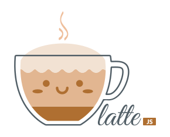

# Latte



Super-minimalistic testing framework to run in browser.

# Install

1. Use UNPKG as a source
   ```
   <script
     type="module"
     data-latte-tests="./my.test.js"
     src="https://unpkg.com/@ludekarts/latte/dist/latte.min.js"
   ></script>
   ```
1. Install with NPM

   ```
   npm install @ludekarts/latte
   . . .

   <script
     type="module"
     data-latte-tests="./my.test.js"
     src="../node_modules/@ludekarts/latte/dist/latte.min.js"
   ></script>
   ```

# Usage

On **📝 test.html** include below

```
<script
  type="module"
  src="./latte.js"
  data-latte-tests="./my.test.js"
></script>
```

On **📝 my.test.js** write test as usual:

```
describe("Sample tests", () => {

  it("Should be OK", () => {
    expect(1).to.have.equal(1);
  });

  it("Should fail", () => {
    expect(1).to.have.equal(2);
  });

});
```

To run **only** one test case follow code below:

```
only.it("Should run only this one", () => {
  expect(1).to.have.equal(1);
});
```

# HTML API

Script tag gets following attributes:

| Attribute        | Value                 | Required | Description                                                      |
| ---------------- | --------------------- | :------: | ---------------------------------------------------------------- |
| type             | module                |    ✔️    | Allows for run and import ESM in JS code                         |
| src              | path/to/latte.js      |    ✔️    | URL to Latte.js                                                  |
| data-latte-tests | path/to/spec.js       |    ✔️    | URL to tests file                                                |
| data-chai        | path/to/chai.js false |    ➖    | Path to Chai library, or "false" to disbale default chai loading |
